1(main)メインモジュール
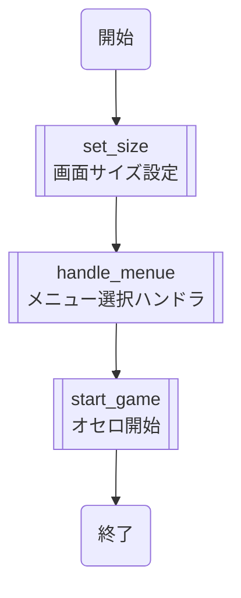

1.1(set_size)画面サイズ設定モジュール
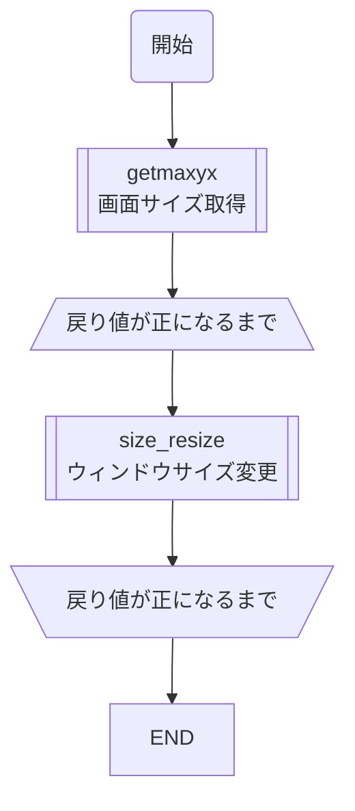

1.1.1(size_resize)画面サイズ強制変更関数
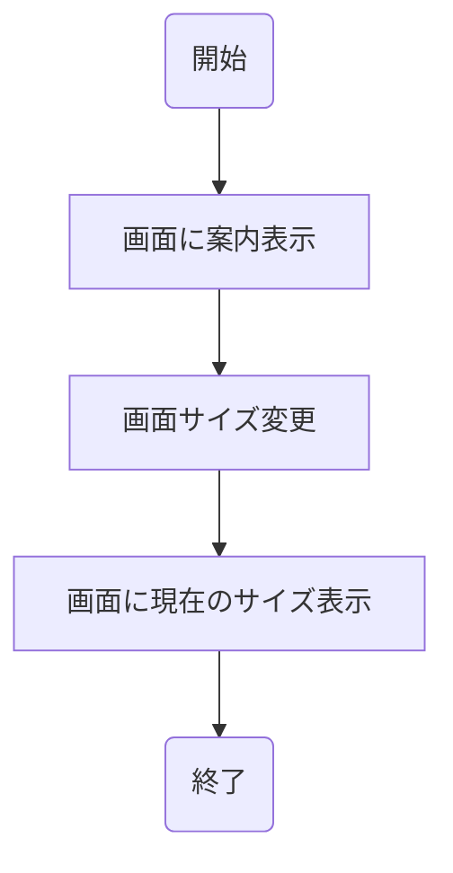

1.2(handle_menue)メニュー選択ハンドラモジュール
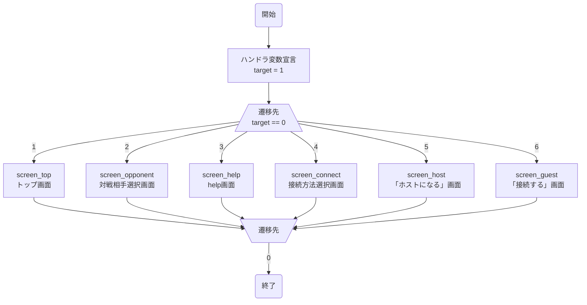

1.2.1(screen_top)トップ画面モジュール
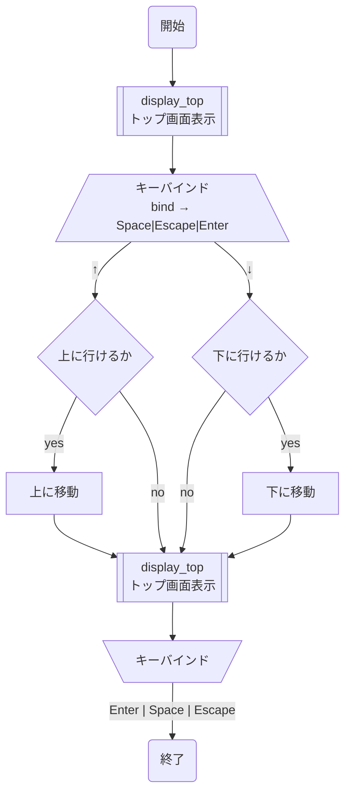
1.2.1.1(display_top)トップ画面表示関数
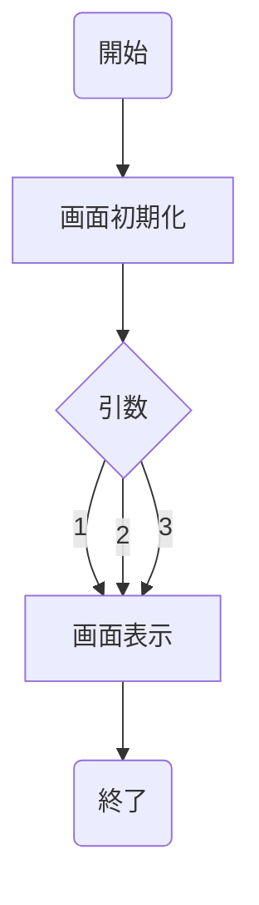

1.2.2(screen_opponent)対戦相手選択画面モジュール
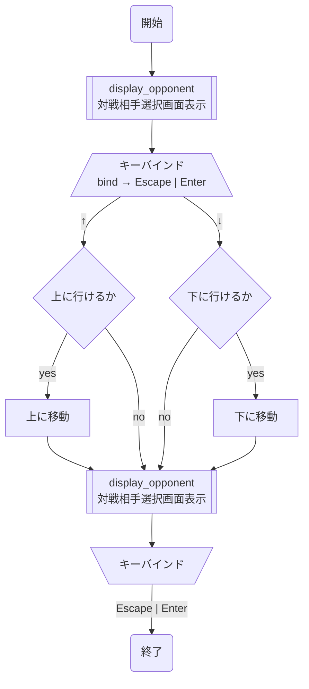

1.2.2.1(display_opponent)対戦相手選択画面表示関数
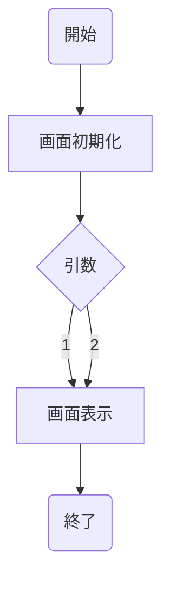

1.2.3(screen_help)help画面モジュール
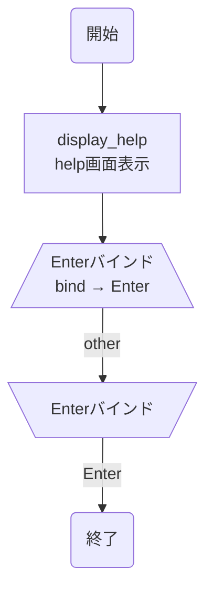
1.2.3.1(display_help)help画面表示関数
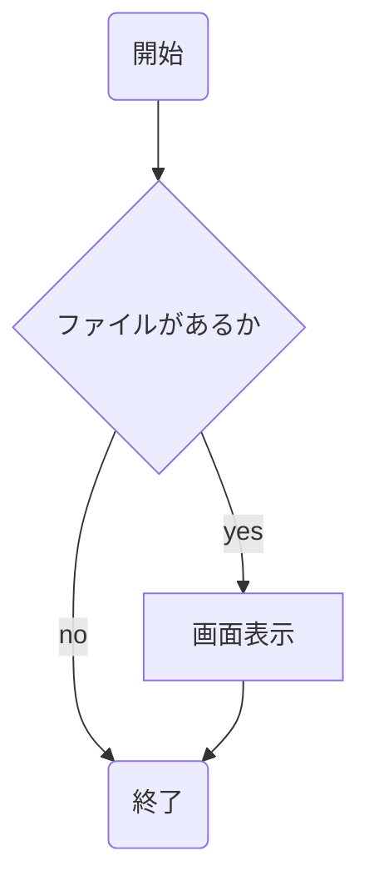

1.2.4(screen_connect)接続方法選択画面モジュール

1.2.4.1(display_connect)接続方法選択画面表示関数

1.2.5(screen_host)「ホストになる」画面モジュール
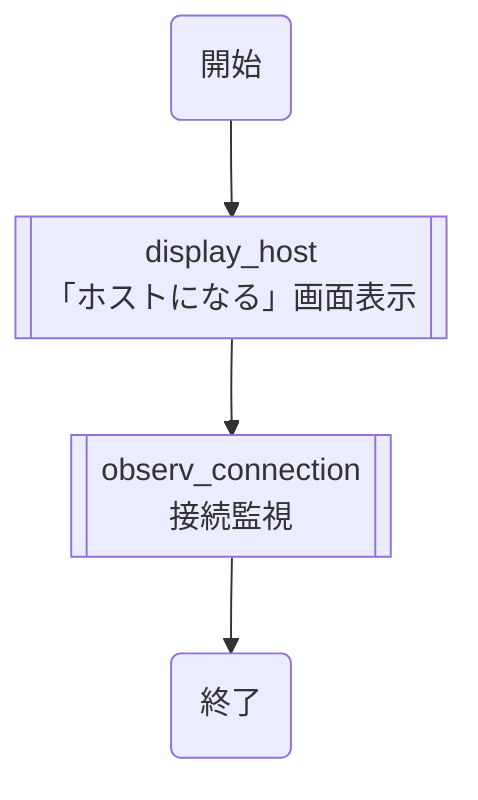
1.2.5.1(display_host)「ホストになる」画面表示関数
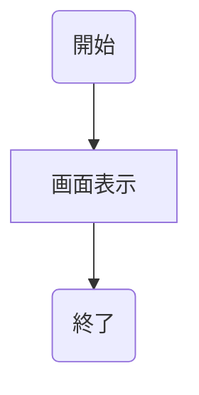
1.2.5.2(observ_connection)接続監視関数
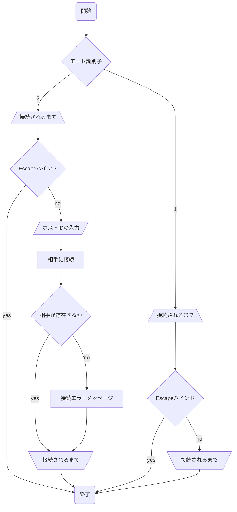

1.2.6(screen_guest)「接続する」画面モジュール
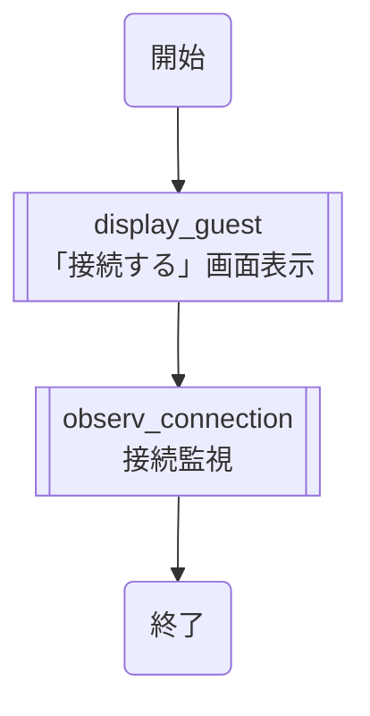
1.2.6.1(display_guest)「接続する」画面表示モジュール


1.3(start_game)ゲーム開始モジュール
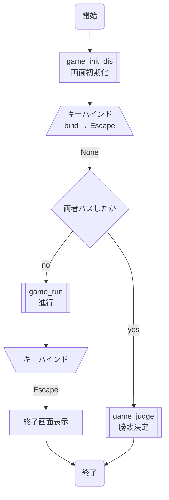
1.3.1(game_init_sp)画面初期化
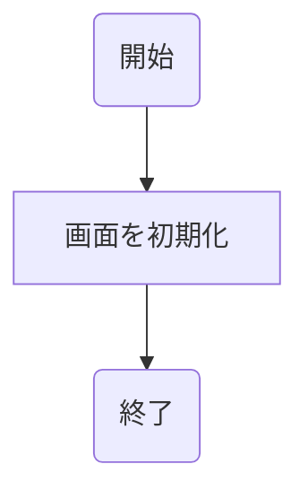


1.3.2(game_run)進行モジュール
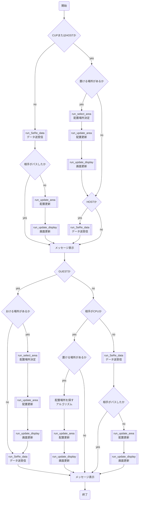

1.3.2.1(game_serch_placeable)配置可能場所探索関数
```mermaid
graph TD
    start(開始) --> all[/全マス探索するまで\];
    all --> allD[/全方向探索するまで\];
    allD --> ch{相手の色があるか};
    ch -- no --> ed[\全方向探索するまで/];
    ch -- yes --> side[/端に行くまで<br>自分の色が見つかるまで\];
    side --> one[１マス進める];
    one --> sidee[\端に行くまで<br>自分の色が見つかるまで/];
    sidee --> ed;
    ed --> alle[\全マス探索するまで/];
    alle --> E(終了);
```

1.3.2.2(run_select_area)配置場所決定関数
```mermaid
graph TD
    start(開始) --> key[/入力待ち<br>key → Enter\];
    key -- Space --> sp[[game_tips<br>ヒント表示]] --> Ekey;
    key -- ↑ --> max{上に行けるか};
    max -- yes --> up[上に移動];
    up --> Ekey;
    max -- no --> Ekey;
    key -- ↓ --> min{下に行けるか};
    min -- yes --> down[下に移動];
    down --> Ekey;
    min -- no --> Ekey;
    key -- → --> right{右に行けるか};
    right -- yes --> right2[右に移動];
    right2 --> Ekey;
    right -- no --> Ekey;
    key -- ← --> left{左に行けるか};
    left -- yes --> left2[左に移動];
    left2 --> Ekey;
    left -- no --> Ekey;
    Ekey -- Enter --> check{置ける場所か};
    check -- yes --> das[配列更新] --> mkda[メッセージを表示] --> END(終了);
    check -- no --> dis[メッセージを表示];
    dis --> key;
    Ekey[\入力待ち/];
```

1.3.2.2.1(game_tips)ヒント表示関数
```mermaid
graph TD
    start(開始) --> sda[ヒントを表示];
    sda　--> E(終了);
```

1.3.2.3(run_update_area)配置更新関数
```mermaid
graph TD
    start(開始) --> op[/全方向探索するまで\];
    op --> das{相手の色があるか};
    das -- yes --> sad[/端に行くまで<br>自分の色が見つかるまで\] --> co[1マス進める];
    co --> sade[\端に行くまで<br>自分の色が見つかるまで/];
    sade --> lll[\全方向探索するまで/];
    das -- no --> lll;
    lll --> END(終了);
```


1.3.2.4(run_update_display)画面更新関数
```mermaid
graph TD
    start(開始) --> o[オセロ表示画面の更新];
    o --> END(終了);
```

1.3.2.5(run_SeRe_data)データ送受信関数
```mermaid
graph TD
    start(開始) --> da[HOSTか] -- yes --> das[データをシリアライズ化] --> ddas[データを送信];
    da -- no --> dsada[データを受信] --> daeraf[データをデシリアライズ化];
    ddas --> END(終了);
    daeraf --> END;
```


1.3.3(game_judge)勝敗決定モジュール
```mermaid
graph TD
    start(開始) --> stone[[count_stone<br>石数検出]];
    stone --> dis[[display_result<br>勝敗画面表示]];
    dis --> END(終了);
```
1.3.3.1(count_stone)石数検出関数
```mermaid
graph TD
    start --> go[配列を探索];
    go --> l[/配列の最後まで\];
    l --> judge{取り出した要素};
    judge -- 1 --> white[白のカウント+1];
    judge -- -1 --> black[黒のカウント+1];
    judge -- 0 -->El;
    white -->El;
    black -->El;
    El[\配列の最後まで/] --> END(終了);
```
1.3.3.2(display_result)勝敗画面表示関数
```mermaid
graph TD
    start(開始) --> s{自分 ? 相手};
    s -- ＞ --> win[勝利画面を表示];
    s -- ＝ --> draw[引き分け画面を表示];
    s -- ＜ --> lose[敗北画面を表示];
    win --> END(終了);
    draw --> END;
    lose --> END;
```
