gcc -o main.exe main.c 1_size/set_size.c 2_menue/handle_menue.c 2_menue/screen_connect.c 2_menue/screen_host.c 2_menue/screen_opponent.c 2_menue/screen_top.c 2_menue/screen_help.c -lncurses

1 メインモジュール
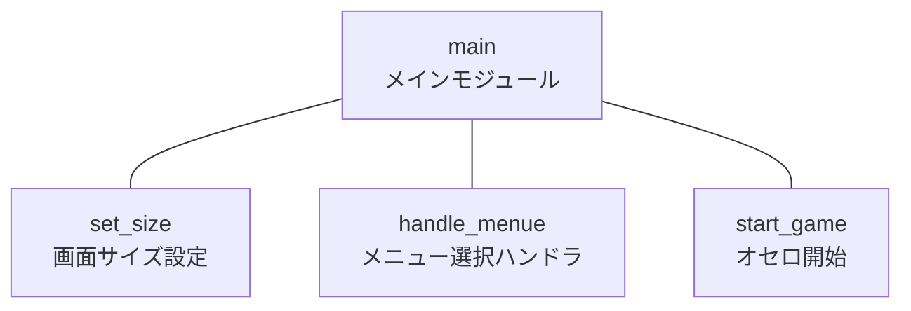
1.1画面サイズ設定モジュール
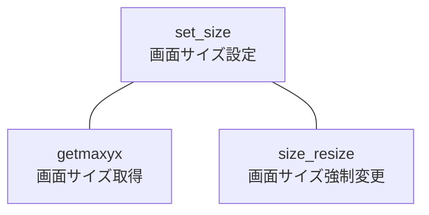
1.2メニュー選択ハンドラモジュール
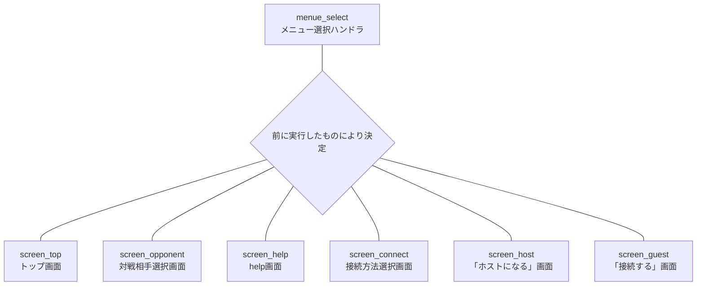
1.2.1トップ画面選択モジュール
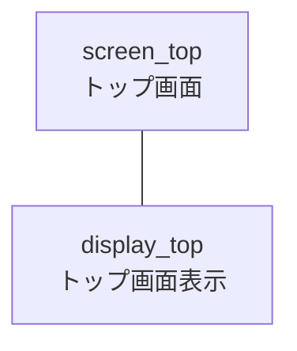
1.2.2対戦相手選択画面モジュール
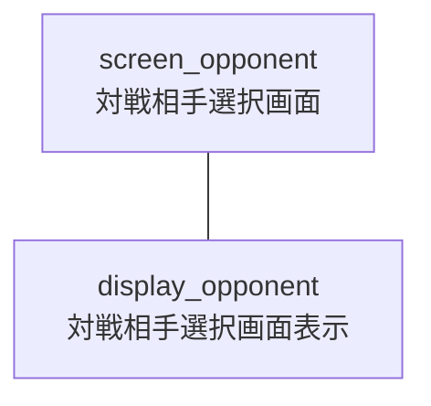
1.2.3help画面モジュール
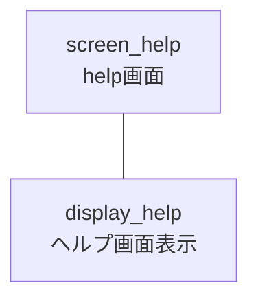
1.2.4接続方法選択モジュール
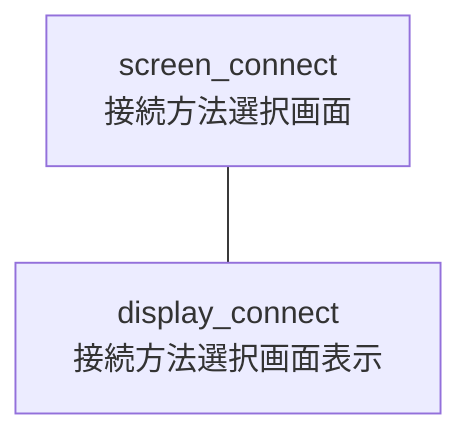
1.2.5「ホストになる」画面モジュール
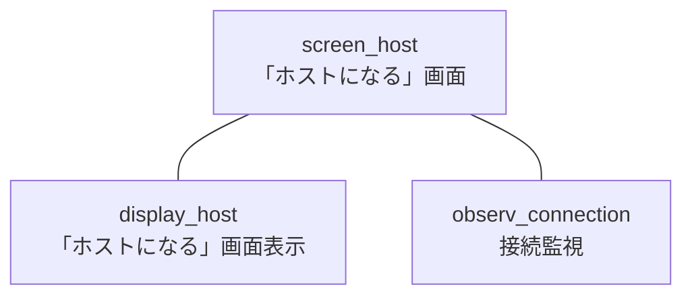
1.2.6「接続する」画面モジュール
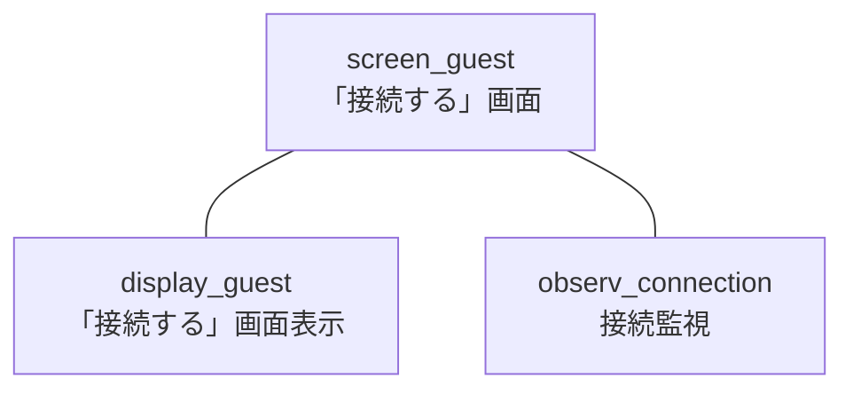

1.3ゲーム開始モジュール
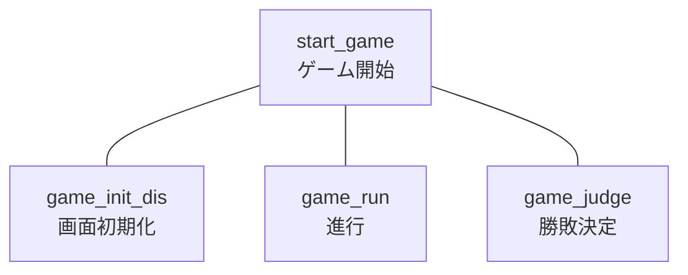

1.3.2進行モジュール
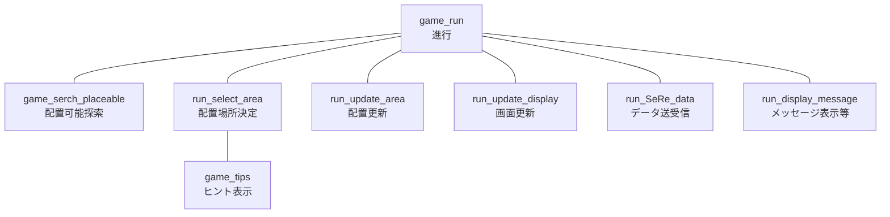
1.3.3勝敗決定モジュール
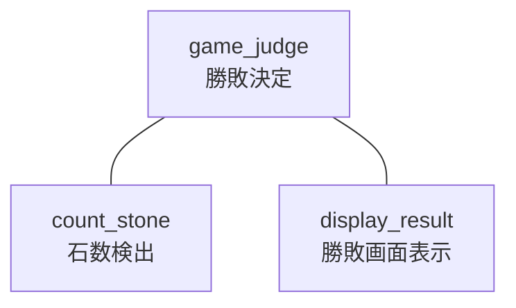
